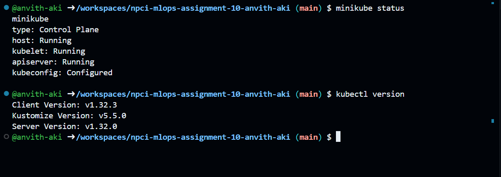

# NPCI MLOps Assignment-10  
# Kubeflow Pipeline for Customer Churn Prediction Model Training

## Kubernetes Cluster Setup

  

## Kubeflow Installation 

#### Kubeflow Pods Listed 
  

#### Kubeflow UI 
  

## Pipeline Creation & Execution

#### Pipeline Convertion 

#### Pipeline Run Successful 

#### Pipeline Stages Output 

#### Pipeline Artifacts

#### Final Model Metrics

---